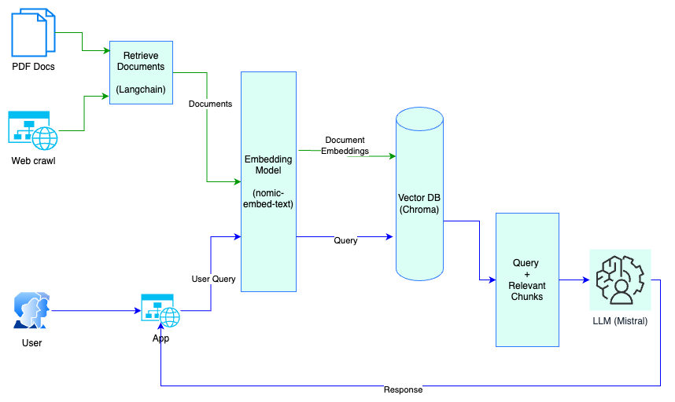

### Requirement
- Given a combination of dataset (PDFs, Web pages, Docs), build a system which can answer the question in a generative way with reference to the section of the doc/page.

# Question Answering Application

This project implements a question-answering system using Langchain, Chroma, and Ollama. The application takes user queries and searches a document database to provide relevant answers along with the sources.


## Installation
1. Navigate to `nlp rag` folder.
2. **Create a virtual environment and activate it:**
    ```sh
    python -m venv venv
    source venv/bin/activate  # On Windows, use `venv\Scripts\activate`
    ```

3. **Install dependencies:**
    ```sh
    pip install -r requirements.txt
    ```

## Architecture


## Usage

### Populate the Database with PDF docs

To populate the database with documents, use the `populate_database.py` script. This script will load documents from the `data` directory, split them into chunks, and store them in a Chroma database.

```sh
python populate_database.py --reset  # Use --reset to clear the existing database
```
### Populate the Database with web crawl

To populate the database with web pages, use the `populate_database.py` script. This script will load documents from the `data` directory, split them into chunks, and store them in a Chroma database.

```sh
python populate_database.py --reset --source 'WEB' --url <url> --limit <limit>
limit is optional.
E.g : python populate_database.py --reset --source 'WEB' --url 'https://www2.gov.bc.ca/gov/content/governments/organizational-structure/ministries-organizations/ministries/children-and-family-development' --limit 100

```
### Query the Database
You can query the database using the query_data.py script. Pass your query as an argument to get an answer based on the context from the documents.

```sh
python query_data.py "Your query here"
```
### Streamlit Application
You can also interact with the question-answering system using a Streamlit web interface. Run the app.py script to start the web application.


```sh
streamlit run app.py
```


## Components
### query_data.py
This script handles querying the database and returning responses based on the context.

### get_embedding_function.py
This script provides the embedding function used to embed documents and queries.

### populate_database.py
This script handles loading documents, splitting them into chunks, and populating the Chroma database.

### app.py
This script implements a Streamlit web application for querying the database interactively.

## Running the Application
### Populate the Database:

```sh
python populate_database.py --reset
```
### Query the Database:

```sh
python query_data.py "Your query here"
```
### Run the Streamlit Application:

```sh
streamlit run app.py
```

## Contact 
Please send an email to sumesh.pk@aot-technologies.com for a demo or to get know more about this prototype.
